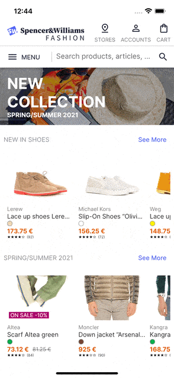

# Flutter Ecommerce UI Template

Get inspiration and speed up your storefront implementation with this Flutter starter kit that helps you rapidly build 
an attractive, first-class search and discovery experience, using [Algolia Helpers for Flutter][1].

The complete documentation is available [here][2].

[1]: https://pub.dev/packages/algolia_helper_flutter
[2]: https://www.algolia.com/doc/guides/building-search-ui/ecommerce-ui-template/ecommerce-ui-template-overview/ios/
